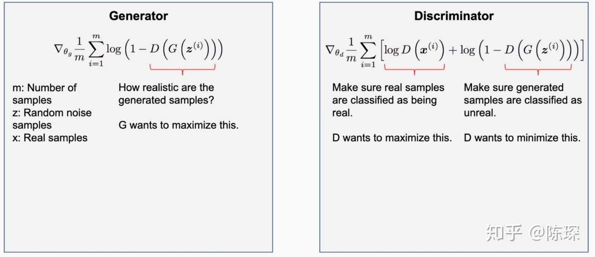
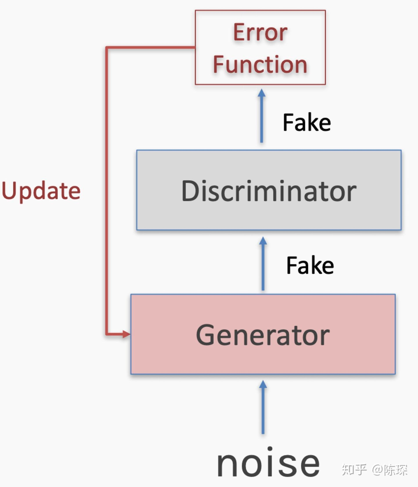
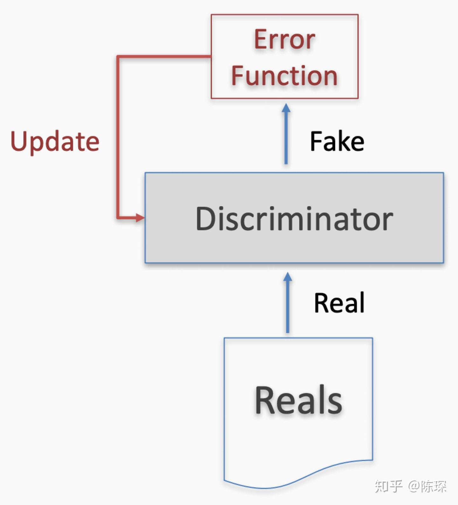
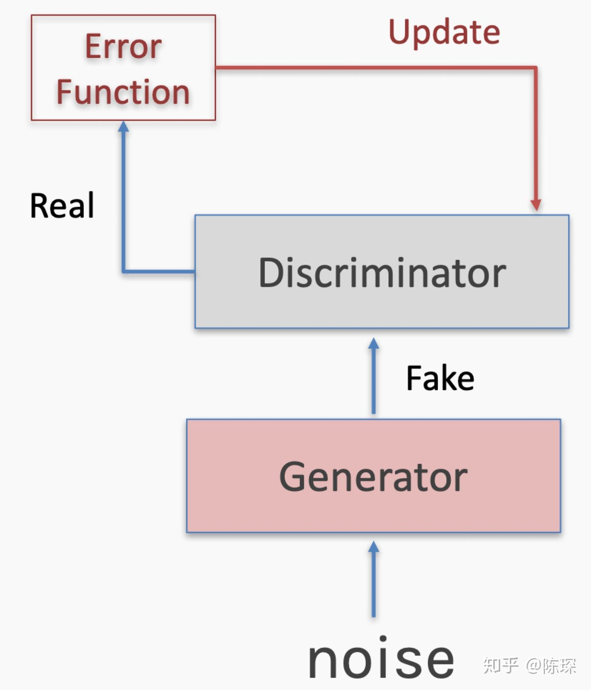
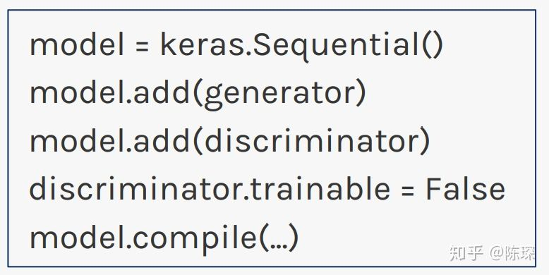

# GAN-v1

## 序言

我想写一个可以自动玩2048的神经网络，但无从下手。所以我就先研究一下对抗神经网络，然后接下来再学习深度神经网络。

## 一、思路

一个生成minst手写图片的程序和minst图像识别的程序进行对抗。

model 1: 输入 int --> 输出 64*64 图像

model 2: 输入 64*64 图像 --> 输出 bool 是否为机器生成

## 二、资料

### 1. 原理

[如何形象又有趣的讲解对抗神经网络（GAN）是什么?](https://www.zhihu.com/question/63493495)

GAN简介

GAN的想法非常巧妙，它会创建两个不同的对立的网络，目的是让一个网络生成与训练集不同的且足以让另外一个网络难辨真假的样本。

训练的步骤包括：
- 1.取batch的训练集x，和随机生成noise z；
- 2.计算loss；
- 3.使用back propagation更新generator和discriminator；

我们已经分析好了，在True Positive，False Negative，False Positive情况下需要更新：

True Positive：意味着generator生成的fake数据被抓包，需要对generator进行优化。需要经过参数被固定的discriminator计算loss，更新generator的权重。注意一次只能对两个网络中的一个进行参数调整。

False Negative：意味着真的训练集被discriminator错认为fake数据。只更新discriminator的权重。

False Positive：generator生成的fake数据，被discriminator判定为真的训练集。只对discriminator进行更新。

### 2. 简单实现

GAN的简单实现
下面是一个最简化的使用Keras实现的GAN，基于CelebA数据集。

model的定义：

1. 定义discriminator，然后compile；
2. 定义generator，不进行compile；
3. 定义一个model包含generator和discriminator，把discriminator设为not trainable，然后compile：

训练loop：

从训练集选择R张图像；
1. 采样大小为N的随机噪声，输入generator产生F张fake的图像；
2. 将R张训练集与F张fake图像和对应的label输入discriminator进行训练；
3. 采样大小为N的随机噪声；
4. 用train_on_batch，以目标label为1对generator进行训练更新。